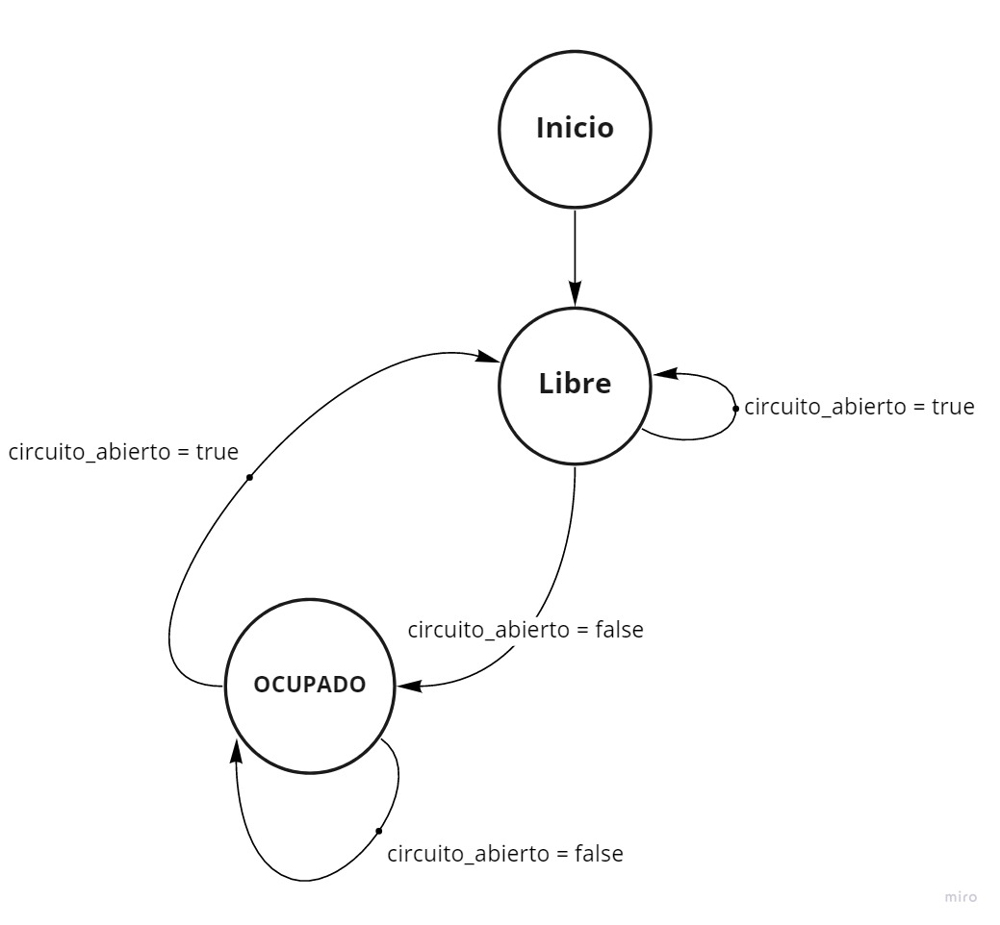

# Barrera Paso a Nivel

### Memoria descriptiva

El sistema desarrollado tiene como objetivo el control de una barrera de paso a nivel para control de tráfico en vías de ferrocarriles.

El principio de funcionamiento está basado en el hecho de que las vías conforman un circuito abierto, en una sección cercana a la barrera.
La barrera comienza levantada, y sin ningún tren en la vía.
Cuando un tren pasa por esta sección, funciona como conector y hace que el circuito se cierre, bajando la barrera. 

La máquina va a constar de 2 estados:

1. Estado inicial con la barrera abierta, esperando a que un tren pase por el circuito.
   - Si pasa, entonces baja la barrera al tener el circuito cerrado, pasando al otro estado.
2. Con la barrera cerrada, esperando a que el tren salga del circuito.
   - Entonces levanta la barrera al tener el circuito abierto, volviendo al estado inicial.

### Máquina de estado de la barrera PAN

 

Datos de la máquina de estado:
- `circuito_abierto`> Es verdadero si y solo si hay un tren en el circuito.

Datos del archivo de configuración:
- `estado_inicial_del_circuito`> Indica si el circuito comienza abierto o cerrado.
- `circuito_abierto`> Es la palabra clave, en forma de String, que se usa para indicar que el circuito está abierto.
- `circuito_cerrado`> Es la palabra clave, en forma de String, que se usa para indicar que el circuito está cerrado.

